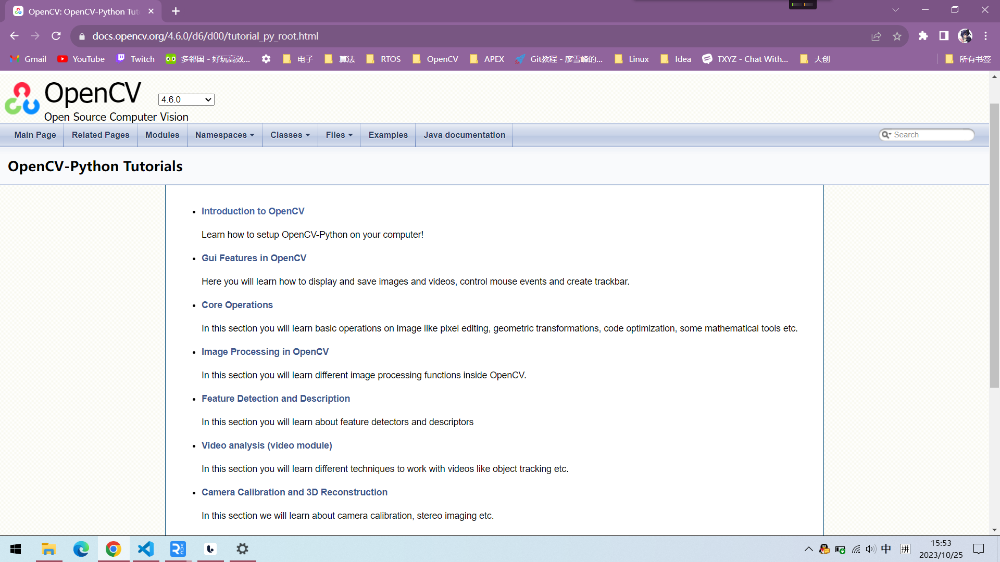
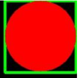
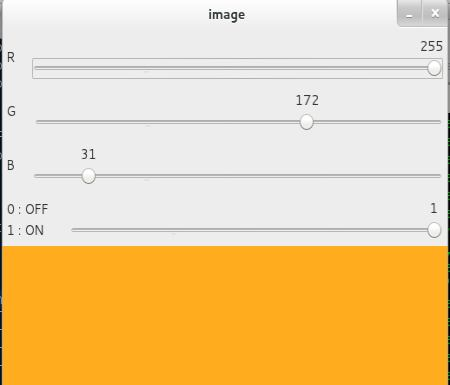

**这里直接给出官方的教程，本文只会推荐一些平时做项目会频繁用到的部分，并对优先级以及重要程度进行划分。**

# 官方教程
[OpenCV-Python Tutorials]( https://docs.opencv.org/4.6.0/d6/d00/tutorial_py_root.html)

# 功能简介及学习优先级分析
## OpenCV 的 GUI 功能(Gui Features in OpenCV)⭐⭐
这一部分是讲述OpenCV中的UI功能，这一部分需要熟练掌握。这一部分分为三个部分导入源文件，绘制功能，TrackBar功能。
### 导入源文件⭐
刚入门推荐从图片开始学习，因为到后边处理视频的时候也是从按照帧进行处理以及后续操作。
### OpenCV中的绘制功能⭐⭐
这一部分主要是学习绘制一些基本功能，比如矩形框、多边形以及圆形文字等。这部分必须熟练掌握，因为后续会用来标志出需要检测的目标。

### TrackBar⭐⭐⭐
TrackBar功能在图像预处理中起着重要作用，在代码中添加TrackerBar可以实时看到更改参数所引起的变化
## OpenCV的核心功能
### 图像的基本理解⭐⭐⭐
当学习OpenCV的时候，我们需要认识到图像实际上是一个个的像素点组成的，我们在处理图像的时候最小的单位是像素，因此我们需要对数组有深刻的理解。又因为是在Python语言进行编写，因此对[numpy包](https://numpy.org/learn/)需要有较为深刻的理解。

通过对像素的处理我们可以方便地分割图像得到我们想要的图像区域，即 **ROI** (Region of Interest) 
### 图像的逻辑与算术运算⭐⭐⭐
个人理解，对于非二值化的图像，我们可以对图像进行虚化等操作并且与其他图像叠加。

图像同样支持逻辑运算（与或非等），可以配合筛选阈值得到我们想要的二值化区域通过逻辑运算得到我们想要的颜色或目标。

## OpenCV图像处理⭐⭐⭐⭐⭐
### 色域变换⭐⭐
不同的摄像头回传的颜色格式并不相同例如RGB、HSV等，对于图像预处理OpenCV给了很多不同的格式转换比如BGR<->HSV，BGR<->GRAY，我们可以根据实际需求来转换不同的色域。

我常用的是HSV色域，提取指定颜色非常好用，这里贴一个[链接](https://cloud.tencent.com/developer/article/1199352?from=15425)，方便各位查找对应颜色的阈值

对于不同颜色可能阈值不好用，这个时候我们就可以添加TrackBar来辅助调整阈值了。
### 