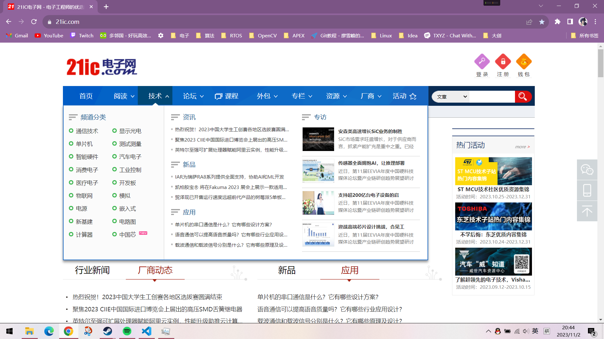
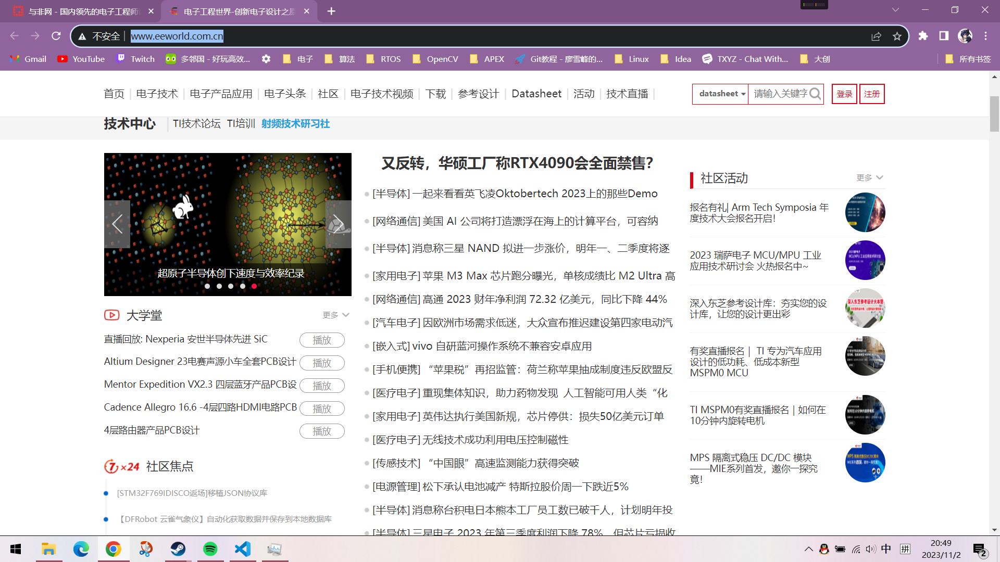
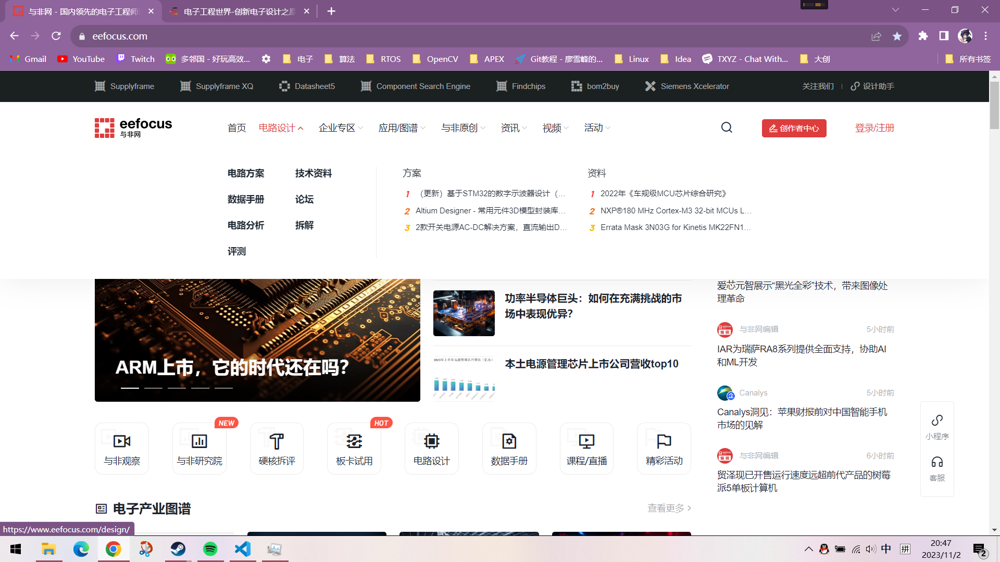

**本篇同样适合所有专业同学进行学习且不设置相关任务，因此可以在此放松一下。😎**

# 0.前言
**什么是硬件？**

>硬件（Hardware）是计算机硬件的简称，是指计算机系统中由电子，机械和光电元件等组成的各种物理装置的总称。这些物理装置按系统结构的要求构成一个有机整体为计算机软件运行提供物质基础。
简而言之，硬件的功能是输入并存储程序和数据，以及执行程序把数据加工成可以利用的形式。从外观上来看，微机由主机箱和外部设备组成。主机箱内主要包括CPU、内存、主板、硬盘驱动器、光盘驱动器、各种扩展卡、连接线、电源等；外部设备包括鼠标、键盘等。

**个人理解，程序软件依赖的所有元器件都可以被称为硬件。**

日常生活中的硬件包括电脑手机，充电器，摄像头，电源，电子设备……硬件的定义非常宽泛。

# 1.日常用电子设备
目前用的最多的电子设备应该是手机，其次是电脑。也许你会在上边进行各种工作，但是你需要注意到你的工作并不会直接操作硬件，你的所有工作都是在其操作系统上进行操作的，至于操作硬件那是操作系统的工作。

总之，我们在操作电子设备时并不会直接操作其底层硬件，我们直接操作硬件或许闭合开关亮灯是一个例子。因此，学会用日常的手机和电脑显然不是我们学习的目标，我们的工作也不是落在手机和电脑上的（当然写代码画图等还是要在电脑上做的🤞），至于建立在什么上请继续往下看。
# 2.计算机科普
很多同学在买电子产品时会着重看硬件参数，比如CPU、内存、硬盘、拓展性如何如何。这一类同学应该也不需要看这一部分，**但是如果你说你对手机配置很熟悉但是不了解电脑，那我觉得你很有必要看这一部分。**

这里不过多介绍[计算机发展历史](https://www.jianshu.com/p/6fb655c286bc)了，只需要知道原先很大很慢，现在很小很快就可以。

**以下内容会在你学习《计算机组成原理》后有重新认识，定义会被重构，因此下方内容并不“专业”**

## 2.1 CPU (Central Processing Unit，中央处理器)
~~别用AMD~~

CPU作为计算机最重要的组成部分之一，承担的整个设备的运作，它决定了设备的运行速度。很多同学担心我的设备是几年前的设备了，会不会出现性能不够的情况。一般不会，因为我们目前的学习不会涉及到那么复杂的运算，而且现在CPU的性能对于日常开发工作来说已经溢出，与其担心性能不够，不如加点内存。

## 2.2 RAM (Random-access memory，内存)
有件很令人费解的事情🤦‍♂️，现在手机厂商都喜欢把存储叫成“内存”，把内存叫成“运行内存”。**纯属混淆视听😅**，以后谁再说电脑内存不够要加硬盘请教你 建议直接让他顺其自然。

言归正传，内存是与CPU直接交换数据的内部存储器。它可以随时读写（刷新时除外），而且速度很快，通常作为操作系统或其他正在运行中的程序的临时资料存储介质。因此我们在运行程序时往往会发现任务管理器中内存的占用率会上升。

互联网早期的加速球加速的原理就是清理内存，给新的程序分配内存。如果内存占用 100% 操作系统会调用磁盘空间来虚拟内存，这部分速度会非常慢(电脑长时间不关机卡顿就是这个道理)而且会极大地影响硬盘寿命。(因此如果你的手机带有内存融合等功能的话建议关掉😁)
## 2.3 存储器 
顾名思义，存储器就是用来存储数据的，包括我们下载保存的文件以及我们的操作系统。同样，谁在管硬盘叫“内存”建议直接??(🤐)。

不出意外现在各位应该用的都是固态硬盘，机械硬盘应该逐渐退出消费级市场了。我们学习的内容就包括了存储器的读写操作只是存储器不能这么大只是很小的64Mbit大小存储芯片，当然这部分我们会通过指令的形式通过几根线来读取一些存储器和TF卡来学习。
## 2.4 GPU (Graphics Processing Unit,图形处理器)
~~别用AMD~~

对于我们消费者来说现在一般叫他显卡，NVIDIA的确做出了很大贡献，但是。(图为Linux创始人Linus)

GPU本质上只能计算简单的运算，如果说CPU是大学生的话，GPU就是小学生，但是GPU是一个1000人的集体，他们都会进行简单的算术运算，其运算速度会碾压CPU这个大学生。而且现代的GPU通常对整数和浮点数有硬件加速，这就更拉大了差距。因此现在深度学习（整数、浮点数运算较多）领域通常会部署大量的GPU集群进行运算。
## 2.5 指令集
这里简单介绍一下指令集，我们需要知道复杂指令集(Complex Instruction Set Computing，CISC)和精简指令集(Reduced Instruction Set Computing，RISC)就行。你正在用的电脑CPU不管是Intel还是AMD它们都是用的复杂指令集之一，即x86或x86-64架构。而你的手机CPU则是则都是用的精简指令集之一，ARM公司的ARM架构。

**该教程所学的绝大多数内容都是基于精简指令集ARM架构的芯片开发。**

# 3.专业相关的电子设备
娱乐结束，现在我们来看一下我们要学什么。
## 3.1 MCU 
一个视频让你明白MCU和CPU的不同，记得辩证看待视频内容。 [内存相差百万倍！单片机和CPU的区别？](https://www.bilibili.com/video/BV1CZ4y1Z79w/?spm_id_from=333.999.0.0&vd_source=5db29094df1f8b26bddd1f8bfeda5fe3)

3min后~😀

看完后你应该就明白差距在哪里了，可利用的资源很少，频率很低，感觉啥都干不了。那么请再看这个视频的**MCU部分** [MCU,MPU,DSP,FPGA是什么意思？-郭天祥](https://www.bilibili.com/video/BV193411y7TW/?spm_id_from=333.337.search-card.all.click&vd_source=5db29094df1f8b26bddd1f8bfeda5fe3)

5min后~🍲

看完后会发现 MCU 价格便宜，功能较为单一反而成为优点，这和我们所学的东西一样，注重一个方向发展才能成为你的优势。我们后边的学习基本上都是基于单片机(MCU)进行的，所以如果你还是有点模糊请再看一遍上个视频。
# 3.2 外设
上节提到MCU功能单一，价格便宜，这就注定其没有太多的外设，所以我们需要搭配外设进行~~食用~~。

前往万能的淘宝进行搜索单片机外设模块我们会发现有非常多的分类。

**根据不同的需求应用MCU配合不同的模块实现相关的功能是我们专业的终极目标。**

现在制板和快递行业已经非常发达，我们可以从淘宝上买到现成的模块，的确会给我们节省很多时间，但是我们会遇到很多问题比如尺寸不合适，接口不一致，接线太复杂，这样我们就需要去自行绘制PCB电路板进行焊接了。😀

# 3.3 原理图->电路板
这一部分选看，但是对于物联网和机器人的学生必看。

我们会购买一些开发板和成品模块，店家一般会提供资料，提供的资料包括示例代码和原理图。示例代码很好理解就是对应芯片烧录代码可以看到想要的效果。而原理图则详细地描述了模块的电路接线，引出的引脚到底连到了哪里，电阻阻值是多少，应该给多少电压才能驱动，这些问题都可以在原理图上找到。因此，读懂原理图是十分重要的，必知必会。

PCB电路板其实就偏向于实物了，通过将原理图应用到的元器件和连线 转到 实物的过程就是绘制PCB的过程，这里包括导线的走线以及一些复杂的知识，现在没必要了解。

关于原理图和PCB的关系这里贴一个视频可以看看，看完就能理解了。[嘉立创 | 匠心与真材，助力每一个硬件梦想](https://www.bilibili.com/video/BV1vv4y1P73k/?spm_id_from=333.999.0.0&vd_source=5db29094df1f8b26bddd1f8bfeda5fe3)
# 4.专业相关电子知识
这一部分选看，但是对于物联网和机器人的学生必看。

相信各位高中都学过物理中的电路，会一些基本的电路分析，但是高中的电路知识肯定远远不够。因此，我们在大学会学三门电路课——**电路、模拟电路和数字电路**

如果是做单纯做嵌入式软件和电控的话电路知识不需要很专业，会分析一些简单的升降压，芯片外围电路，模数分离，看懂原理图就足够。但是如果要做电源、信号方向的话那就是另一个标准了，不在这个指南的范畴。

## 4.1 电路
电路这门课会从一种专业的角度去教你分析电路，可以看作是高中电学的专业延伸？电路会教你基本的电压电流分析方法，比如著名的[基尔霍夫定律](https://baike.baidu.com/item/%E5%9F%BA%E5%B0%94%E9%9C%8D%E5%A4%AB%E5%AE%9A%E5%BE%8B/2371560)教你如何分析电压电流，还会教你一些常用的电子元件比如电阻电容电感理论知识，你会学到如何使用电阻电容做一个延时电路等等……

 后续的模电数电的分析方法都会依赖电路中的很多定律，当然不推荐当前阶段直接去学习电路，因为电路中有些知识需要高数中的一些思维，直接学很难理解（大佬忽略）。
## 4.2 模拟电路（模电）
模电，亦称魔法电路。😇

模拟电路研究的是模拟信号，这里穿插一下什么是模拟信号什么是数字信号。
- 模拟信号（Analog signal）是指在时域上数学形式为连续函数的讯号，类比正弦函数这种能在y轴取到∞个值。
- 数字信号（Digital signal）一般用离散化数值0/1表示。

OK，那么这门课学什么呢？🤔

我们会学习各种二极管、各种三极管（⭐核心⭐）、各种MOS管。平时应用上我们可以参考音响，音响内部有一个功率放大器，可以将我们手机3.5mm音频线输出几mW的音频信号放大到几十瓦甚至几百瓦。还有麦克风实际上也是模拟电路的应用，将声音振动的能量转换为电压，这个电压就是模拟量。

## 4.3 数字电路（数电）
数电应该就比较好懂了🙂，因为现在的电子设备存储计算绝大多数都是用数字信号。

数电这门课主要学习各种数字芯片，编码器，译码器，数据选择器……各种型号眼花缭乱，我们不需要研究其内部组成，只需要会使用即可。

数字信号因为可以简化为 0 1 来表示，我们目前的计算机相关几乎都是二进制表示，因此 0 1 信号会用来实现各种功能，比如通信、存储、计算……

数电这门课相比模电对嵌入式来说更为重要一些，因为我们实际操作的时候不管是运算还是通信用的几乎都用到数字电路的知识。

# 5.从哪里找这些资料？
## 5.0 专业书籍
专业书籍始终是最核心的参考资料，这方面国内外都有很好的教材以及专业书籍。
- 国内的教材有一说一很有难度，对于学习来说门槛很高，但好在国内配套的视频课比较多，很多知名老师都会做公开课。
- 国外教材就需要有一些英语基础了，需要专业英语多一点，这些英语可能在四六级词汇上找不到，因此需要你遇到生词就去查；好处是你会对一些符号的缩写有更好的理解，同时国外教材不会直接上公式，理解方便一点。（顺便提高你的英语能力😁）

有个网站叫 [zlibrary](https://singlelogin.site) 有些电子书可以在上边找，方便平板同学。

## 5.1 B站
**大忌：直接搜《XXX七天速成》等等等等** 

提前避坑标题如《清 * 大学大佬XXX》《北 * 大学终于把XXX讲明白了》《华 * 内部教学视频》

我原先喜欢看视频学，但一年后发现速度太慢，不如看文档。

这一阶段不需要学习以上电路知识，有些了解即可，这里推荐几个我喜欢的UP主。😉
- [稚晖君](https://space.bilibili.com/20259914/?spm_id_from=333.999.0.0) 新人必看，专业，大佬，牛。

- [郭天祥老师](https://space.bilibili.com/1042590734/?spm_id_from=333.999.0.0) 专业，经典，PN学堂对于学习电路有帮助。

- [硬汉嵌入式](https://space.bilibili.com/678329477/?spm_id_from=333.999.0.0) 嵌入式周报可看，前沿信息

- [爱上半导体](https://space.bilibili.com/395188578/?spm_id_from=333.999.0.0) 娱乐，轻松，可以看一些科普，但注意甄别。

- [芯板坊](https://space.bilibili.com/2097113874/?spm_id_from=333.999.0.0) 开发板科普，同上。

- [3Blue1Brown](https://space.bilibili.com/88461692/?spm_id_from=333.999.0.0) 国外，数学，全新角度，牛逼。

## 5.2 电子网站
电子网站需要自己去摸索，有些问题搜索引擎会给你这些网站的结果，我只是把我收集到的电子网站展示出来。

- [21ic电子网](https://www.21ic.com/)网站资源挺全的，上到论坛大佬，下到教程资源。

- [电子工程世界](http://www.eeworld.com.cn/) 同上

- [与非网](https://www.eefocus.com/) 手册挺全好找。

## 5.3 其他（纯个人观点）
**有些人去抖音、小红书找专业知识，我觉得很奇怪，很抽象😅。（还不如贴吧） 不会真有人觉得能靠刷点视频，看篇小短文就学会专业知识和一些技能吧？**

**这种现象不是一个两个同学出现，希望诸位能够摆正态度。**

