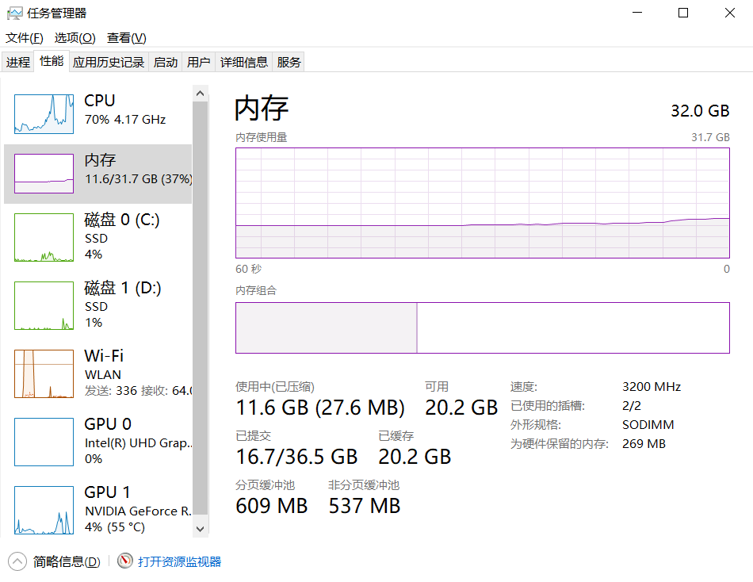

**本篇同样适合所有专业同学进行学习且不设置相关任务，因此可以在此放松一下。😎**

# 0.前言
**什么是硬件？**

>硬件（英文名Hardware）是计算机硬件的简称（中国大陆及香港用语，台湾叫作:硬体），是指计算机系统中由电子，机械和光电元件等组成的各种物理装置的总称。这些物理装置按系统结构的要求构成一个有机整体为计算机软件运行提供物质基础。
简而言之，硬件的功能是输入并存储程序和数据，以及执行程序把数据加工成可以利用的形式。从外观上来看，微机由主机箱和外部设备组成。主机箱内主要包括CPU、内存、主板、硬盘驱动器、光盘驱动器、各种扩展卡、连接线、电源等；外部设备包括鼠标、键盘等。

**个人理解，程序软件依赖的所有元器件都可以被称为硬件。**

日常生活中的硬件包括电脑手机，充电器，摄像头，电源，电子设备……硬件的定义非常宽泛，本文要讲的显然不是这种商业化的产品，本文会聚焦于微观层面，详细到常见的电子元器件以及一些硬件系统。
# 1.日常用电子设备
目前用的最多的电子设备应该是手机，其次是电脑。也许你会在上边进行各种工作，但是你需要注意到你的工作并不会直接操作硬件，你的所有工作都是在其操作系统上进行操作的，至于操作硬件那是操作系统的工作。

很明显，我们在操作电子设备时并不会直接操作其底层硬件，我们直接操作硬件或许闭合开关亮灯是一个例子。因此，用日常的手机和电脑显然不是我们学习的目标，我们的工作也不是建立在手机和电脑上的，至于建立在什么上请继续往下看。
# 2.计算机科普
很多同学在买电子产品时会着重看硬件参数，比如CPU、内存、硬盘、拓展性如何如何。这一类同学应该也不需要看这一部分，但是如果你说你对手机配置很熟悉但是不了解电脑，那我觉得你很有必要看这一部分。

这里不过多介绍[计算机发展历史](https://www.jianshu.com/p/6fb655c286bc)了，只需要知道原先很大很慢，现在很小很快就可以。

**以下内容会在你学习《计算机组成原理》后有重新认识，定义会被重构，因此下方内容并不“专业”**

## 2.1 CPU (Central Processing Unit，中央处理器)
别用AMD

CPU作为计算机最重要的组成部分之一，承担的整个设备的运作，它决定了设备的运行速度。很多同学担心我的设备是几年前的设备了，会不会出现性能不够的情况。一般不会，因为我们目前的学习不会涉及到那么复杂的运算，而且现在CPU的性能对于日常开发工作已经溢出，与其担心性能不够，不如加点内存。

## 2.2 RAM (Random-access memory，内存)
有件很令人费解的事情🤦‍♂️，现在手机厂商都喜欢把存储叫成“内存”，把内存叫成“运行内存”。**纯属混淆视听😅**，以后谁再说电脑内存不够要加硬盘请教你 建议直接run。

言归正传，内存是与CPU直接交换数据的内部存储器。它可以随时读写（刷新时除外），而且速度很快，通常作为操作系统或其他正在运行中的程序的临时资料存储介质。因此我们在运行程序时往往会发现任务管理器中内存的占用率会上升。

互联网早期的加速球加速的原理就是清理内存，给新的程序分配内存。如果内存占用 100% 操作系统会调用磁盘空间来虚拟内存，这部分速度会非常慢(电脑长时间不关机卡顿就是这个道理)而且会极大地影响硬盘寿命。
## 2.3 存储器 
顾名思义，存储器就是用来存储数据的，包括我们下载保存的文件以及我们的操作系统。同样，谁在管硬盘叫“内存”建议直接??(🤐)。

不出意外现在各位应该用的都是固态硬盘，机械硬盘应该逐渐退出消费级市场了。我们学习的内容就包括了存储器的读写操作只是存储器不能这么大只是很小的64Mbit大小存储芯片，当然这部分我们会通过指令的形式通过几根线来读取一些存储器和TF卡来学习。
## 2.4 GPU (Graphics Processing Unit,图形处理器)
别用AMD

对于我们消费者来说现在一般叫他显卡，NVIDIA的确做出了很大贡献，但是。(图为Linux创始人Linus)

GPU本质上只能计算简单的运算，如果说CPU是大学生的话，GPU就是小学生，但是GPU是一个1000人的集体，他们都会进行简单的算术运算，其运算速度会碾压CPU这个大学生。而且现代的GPU通常对整数和浮点数有硬件加速，这就更拉大了差距。因此现在深度学习（整数、浮点数运算较多）领域通常会部署大量的GPU集群进行运算。
## 2.5 指令集
这里简单介绍一下指令集，我们需要知道复杂指令集(Complex Instruction Set Computing，CISC)和精简指令集(Reduced Instruction Set Computing，RISC)就行。你正在用的电脑CPU不管是Intel还是AMD它们都是用的复杂指令集，即x86架构。而你的手机CPU则是则都是用的精简指令集之一，ARM公司的ARM架构。

**该教程所学的绝大多数内容都是基于精简指令集ARM架构的芯片开发。**

# 3.专业相关的电子设备
娱乐结束，现在我们来看一下我们要学什么。
## 3.1 MCU 
一个视频让你明白MCU和CPU的不同，记得辩证看待视频内容。 [内存相差百万倍！单片机和CPU的区别？](https://www.bilibili.com/video/BV1CZ4y1Z79w/?spm_id_from=333.999.0.0&vd_source=5db29094df1f8b26bddd1f8bfeda5fe3)

3min后~😀

看完后你应该就明白差距在哪里了，可利用的资源很少，频率很低，感觉啥都干不了。那么请再看这个视频的MCU部分[MCU,MPU,DSP,FPGA是什么意思？-郭天祥](https://www.bilibili.com/video/BV193411y7TW/?spm_id_from=333.337.search-card.all.click&vd_source=5db29094df1f8b26bddd1f8bfeda5fe3)

5min后~🍲

看完后会发现 MCU 价格便宜，功能较为单一反而成为优点，这和我们所学的东西一样，注重一个方向发展才能成为你的优势。我们后边的学习基本上都是基于单片机(MCU)进行的，所以如果你还是有点模糊请再看一遍上个视频。
# 3.2 外设
上节提到MCU功能单一，价格便宜，这就注定其没有太多的外设，所以我们需要搭配外设进行~~食用~~。

前往万能的淘宝进行搜索单片机外设模块我们会发现有非常多的分类。

**根据不同的需求应用MCU配合不同的模块实现相关的功能是我们专业的终极目标。**

现在制板和快递行业已经非常发达，我们可以从淘宝上买到现成的模块，的确会给我们节省很多时间，但是我们会遇到很多问题比如尺寸不合适，接口不一致，接线太复杂，这样我们就需要去自行绘制PCB电路板进行焊接了。😀

# 3.3 原理图->电路板
这一部分选看，但是对于物联网和机器人的学生必看。

我们会购买一些开发板和成品模块，店家一般会提供资料，提供的资料包括示例代码和原理图。示例代码很好理解就是对应芯片烧录代码可以看到想要的效果。而原理图则详细地描述了模块的电路接线，引出的引脚到底连到了哪里，电阻阻值是多少，应该给多少电压才能驱动，这些问题都可以在原理图上找到。因此，读懂原理图是十分重要的，必知必会。

PCB电路板其实就偏向于实物了，通过将原理图应用到的元器件和连线 转到 实物的过程就是绘制PCB的过程，这里包括导线的走线以及一些复杂的知识，现在没必要了解。

关于原理图和PCB的关系这里贴一个视频可以看看，看完就能理解了。[嘉立创 | 匠心与真材，助力每一个硬件梦想](https://www.bilibili.com/video/BV1vv4y1P73k/?spm_id_from=333.999.0.0&vd_source=5db29094df1f8b26bddd1f8bfeda5fe3)
# 4.专业相关电子知识
这一部分选看，但是对于物联网和机器人的学生必看。

电路 模电 数电

完了

待更新……
# 5.从哪里找这些资料？
待更新……
