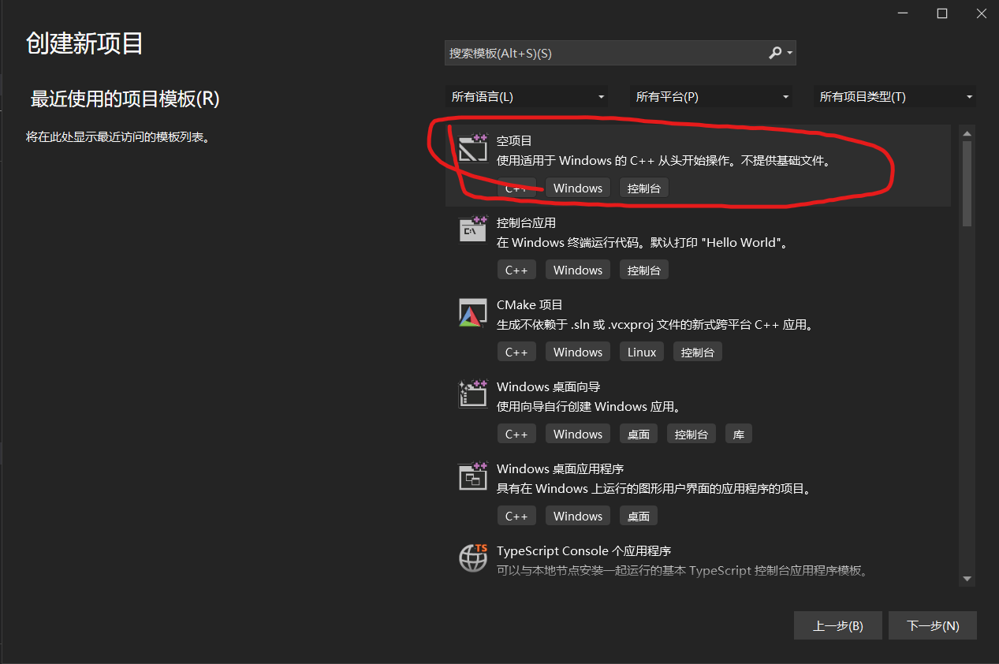
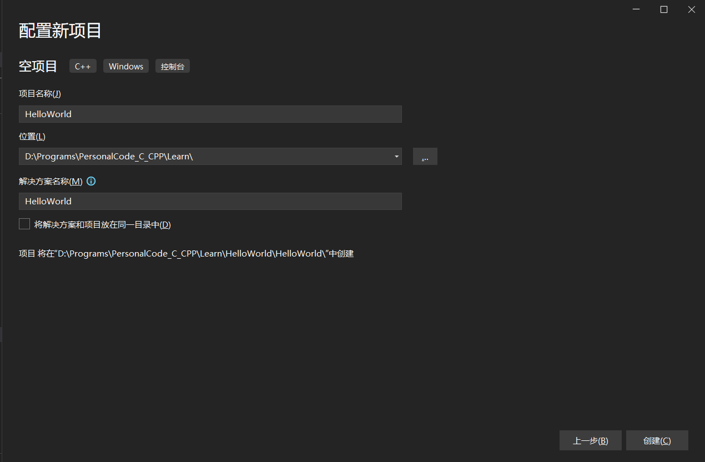
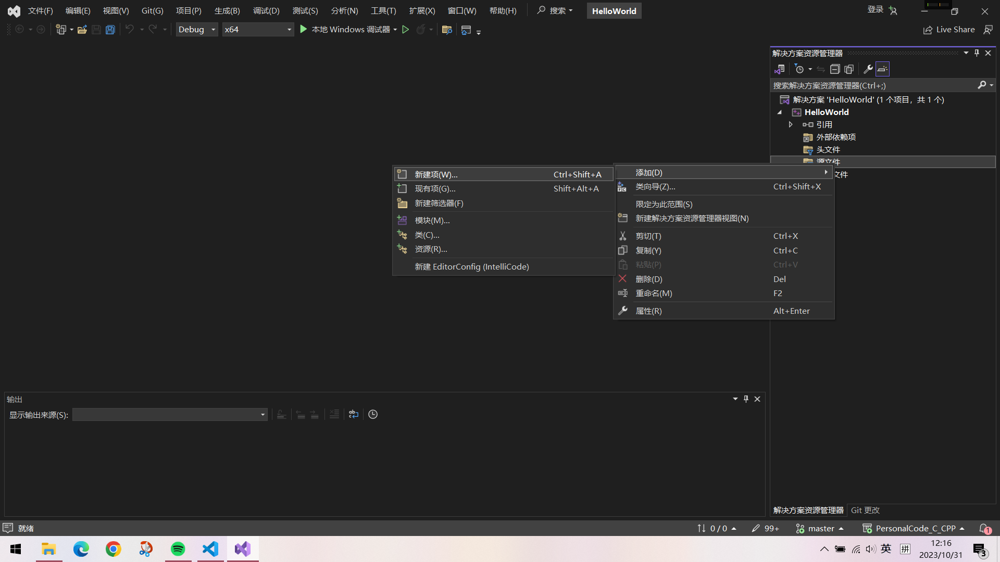
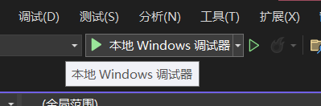
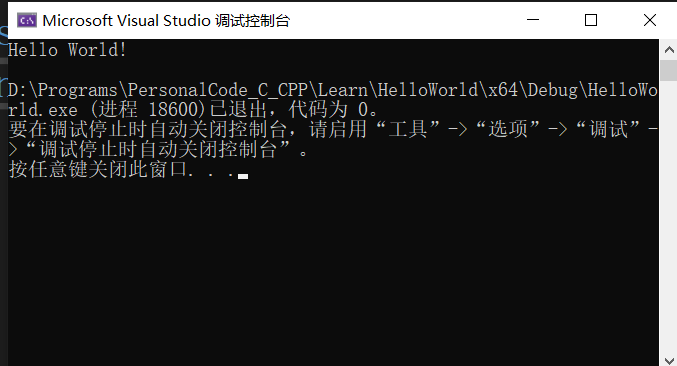
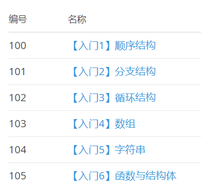

# 写在前面
**统一要求**：
- 写代码一定要用英文；
- 代码一定要排版整齐；
- 请教问题时一定要写注释；

# 0.添加英文输入法
如果你觉得按```shift```切换中英文方便的话可以跳过这部分直接看下一节；

**切换输入法的重要性：** 对于每个初学编程的新人来说，英文输入法往往是最容易忽略的。或许你原先尝试过写代码，复制的代码能用但是自己打一遍就 bug 频发，很有可能是没有切换英文输入法。这里贴一篇[博客](https://zhuanlan.zhihu.com/p/539951858)详细地教你怎样添加英文输入法，并学会使用快捷键切换输入法，附赠[官方链接](https://support.microsoft.com/zh-cn/windows/%E5%9C%A8-windows-%E4%B8%AD%E7%AE%A1%E7%90%86%E8%BE%93%E5%85%A5%E5%92%8C%E6%98%BE%E7%A4%BA%E8%AF%AD%E8%A8%80%E8%AE%BE%E7%BD%AE-12a10cb4-8626-9b77-0ccb-5013e0c7c7a2)。

**选择一个合适编程语言进行学习：** 这里首推 ```C语言``` ，C语言是面向过程的语言，虽然刚开始看很抽象，但是必须学。学完这一篇之后，应该能学会使用一些基本语法并且会解决一些简单的问题。C++也可以，但是初学C++学的东西和C语言别无二致，不属于编程基础的范畴，所以当前阶段 C约等于C++ 。至于像Python和Java，如果你要学嵌入式或做相关工作，我建议你先不要浪费时间去学这些语言，学几周C语言后会发现逻辑基本上相通。

**最后，一定要手打代码，不要觉得看着很简单。**

**最后，一定要手打代码，不要觉得看着很简单。**

**最后，一定要手打代码，不要觉得看着很简单。**

# 1.编译环境与编译器选择
## 操作系统
本篇默认操作系统为**Windows10** ，如果你不是Windows系统，是MacOS的话建议寻找其他教程（xd没用过MacOS）。

## 编译器选择
部分高中或假期做过程序设计竞赛的同学可能用过Dev C++这个软件，这款软件已经不适合现阶段了，但是做一些算法题还是可以的，考虑到后续学习推荐更换以下软件，当然也可保留（怀念）。

若你第一个学期就有编程课的话，老师应该会教你安装一款Visual Studio的软件，可能版本是2010甚至更老，这里推荐升级到 ``` Visual Studio 2022 ``` ,只安装C/C++开发就好，不推荐安装其他组件，比如Python。

如果不想选择上述软件，可以选择 ```CLion``` 进行开发，相比  ``` Visual Studio 2022 ``` 来说 ```CLion``` 启动更快，该有的功能也都有。
# 2.创建一个项目
- 打开 ``` Visual Studio 2022 ```

- 点击创建新项目后选择空项目

可以选择更改一下保存位置，然后直接创建项目。

按照下图所示 在右键点击源文件->添加->新建项 后输入```HelloWorld.cpp```创建文件

复制以下代码进编辑区。
```
#include "iostream"
using namespace std;
int main()
{
	printf("Hello World!\n");
	return 0;
}
```

之后点击上方```本地Windows调试器```编译运行文件。


运行后将会发现弹出一个新窗口，第一行显示了我们想要的语句 ```Hello World! ```，恭喜你，已经完成了最开始的一步，正式走上一条程序员的道路。


# 3.二八定律速通C语言基本语法
First Question：什么是二八定律？
帕累托法则指出，约仅有20%的因素影响80%的结果。也就是说：所有变因中，最重要的仅有20%，虽然剩余的80%占了多数，影响的幅度却远低于“关键的少数”。

> 本节核心是这篇教程 [C 语言入门手册：几小时内就能学会的 C 语言基础](https://www.freecodecamp.org/chinese/news/the-c-beginners-handbook/)

这是我看过对于新手最通俗易懂的一版C语言入门手册。这里边所有的内容都需要完全掌握，**因此你必须要手敲里边所有的代码** 。

对于 [C 语言入门手册：几小时内就能学会的 C 语言基础](https://www.freecodecamp.org/chinese/news/the-c-beginners-handbook/) 里边的内容，我推荐顺序观看但是在[第二节 变量与类型](https://www.freecodecamp.org/chinese/news/the-c-beginners-handbook/#variables-and-types)后直接看[第十一节 输入与输出](https://www.freecodecamp.org/chinese/news/the-c-beginners-handbook/#input-and-output) 然后再回去看第四节比较好。

如果你觉得里边有些东西还搞不懂，首先推荐微软官方的[C语言参考](https://learn.microsoft.com/zh-cn/cpp/c-language/c-language-reference?view=msvc-170)。

或者使用 **[Bing](https://cn.bing.com/)** 去搜索你要找的问题而不是用 百度 ，时代变了……  在这个过程中会发现有些问题会在国内社区比如 [**CSDN**](https://www.csdn.net/) 或者 [**博客园**](https://www.cnblogs.com/) 中找到解决方法。
# 4.Final Round
在手敲完上述代码后，相信你已经会使用C语言解决一些简单的实际问题了。什么，你一时找不到合适的问题去解决，那么就去这个[洛谷网站](https://www.luogu.com.cn/)去刷题吧！


注册个账号就可以开始刷题了。这里 **强制** 要求各位初学者将页面左侧 **题单** 选项页中入门1-5里所有的入门题全部刷完，入门6也要做一点。每个里边有有大约15道题目，强烈推荐全部刷完。如果时间不充裕可以适当放宽标准，但是里边的题目最后一定要全部刷完。


# 5.结语
如果你能坚持刷完上边的这些题应该就能练出一点编程的逻辑思维了，看待问题的角度也会变化，也就意味着可以去看 [算法基础](./算法基础.md) 了。😊

