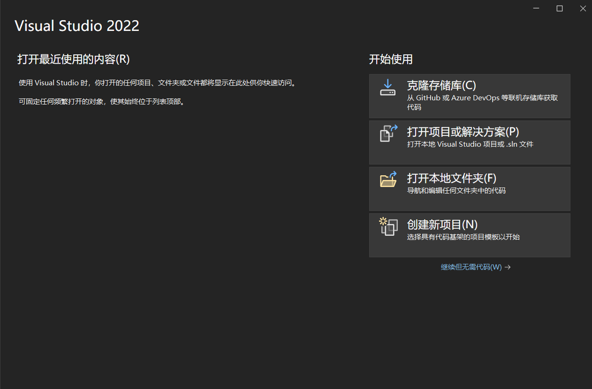

# 写在前面
**统一要求**：
- 写代码一定要用英文；
- 代码一定要排版整齐；
- 请教问题时一定要写注释；

# 0.添加英文输入法
如果你觉得按```shift```切换中英文方便的话可以跳过这部分直接看下一节；

**切换输入法的重要性：** 对于每个初学编程的新人来说，英文输入法往往是最容易忽略的。或许你原先尝试过写代码，复制的代码能用但是自己打一遍就 bug 频发，很有可能是没有切换英文输入法。这里贴一篇[博客](https://zhuanlan.zhihu.com/p/539951858)详细地教你怎样添加英文输入法，并学会使用快捷键切换输入法，附赠[官方链接](https://support.microsoft.com/zh-cn/windows/%E5%9C%A8-windows-%E4%B8%AD%E7%AE%A1%E7%90%86%E8%BE%93%E5%85%A5%E5%92%8C%E6%98%BE%E7%A4%BA%E8%AF%AD%E8%A8%80%E8%AE%BE%E7%BD%AE-12a10cb4-8626-9b77-0ccb-5013e0c7c7a2)。

**选择一个合适编程语言进行学习：** 这里首推 ```C语言``` ，C语言是面向过程的语言，虽然刚开始看很抽象，但是必须学。学完这一篇之后，应该能学会使用一些基本语法并且会解决一些简单的问题。C++也可以，但是初学C++学的东西和C语言别无二致，不属于编程基础的范畴，所以当前阶段 C==C++ 。至于像Python和Java，如果你要学嵌入式或做相关工作，我建议你先不要浪费时间去学这些语言，学几周C语言后会发现逻辑基本上相通。

**最后，一定要手打代码，不要觉得看着很简单。**

**最后，一定要手打代码，不要觉得看着很简单。**

**最后，一定要手打代码，不要觉得看着很简单。**

# 1.编译环境与编译器选择
## 操作系统
本篇默认操作系统为**Windows10** ，如果你不是Windows系统，是MacOS的话建议寻找其他教程（xd没用过MacOS）。

## 编译器选择
部分高中或假期做过程序设计竞赛的同学可能用过Dev C++这个软件，这款软件已经不适合现阶段了，但是做一些算法题还是可以的，考虑到后续学习推荐更换以下软件，当然也可保留（怀念）。

若你第一个学期就有编程课的话，老师应该会教你安装一款Visual Studio的软件，可能版本是2010甚至更老，这里推荐升级到 ``` Visual Studio 2022 ``` ,只安装C/C++开发就好，不推荐安装其他组件，比如Python。

如果不想选择上述软件，可以选择 ```CLion``` 进行开发，相比  ``` Visual Studio 2022 ``` 来说 ```CLion``` 启动更快，该有的功能也都有。
# 2.创建一个项目
- 打开 ``` Visual Studio 2022 ```

- 点击创建新项目后选择空项目


